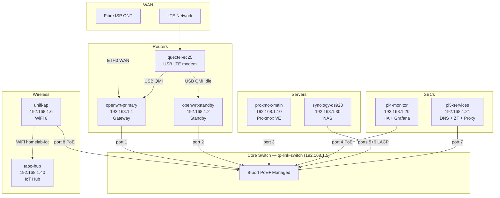

# Network Topology

> Agent-maintained. Regenerate the full Mermaid block after any topology change.
> See [[../meta/routing-state|routing-state]] for current active scheme.

## Physical / Logical Diagram

## State Machine Links

- Active routing scheme: [[../meta/routing-state|routing-state.md]]
- IP assignments: [[ip-schema|IP Schema]]
- WAN failover logic: [[routing-overview|Routing Overview]]
- ZeroTier overlay: [[zerotier|ZeroTier]]
