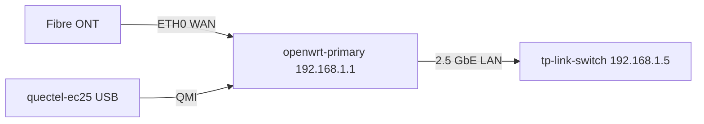

# OpenWrt Primary Router

## Overview

Primary LAN gateway and WAN failover manager for the homelab. Runs mwan3 to automatically balance or fail over between the home fibre connection and the LTE modem. All LAN clients receive DHCP leases with this device as gateway (192.168.1.1).

## Hardware / Specs

| Field | Value |
|---|---|
| Model | OpenWrt One (Banana Pi BPI-R3 Mini) |
| CPU | MediaTek MT7981B (Filogic 820), 2× Cortex-A53 @ 1.3 GHz |
| RAM | 512 MB DDR4 |
| Storage | 128 MB NOR flash + 4 GB eMMC |
| WAN ports | 2× 2.5 GbE (ETH0 = fibre ONT, ETH1 = unused) |
| LAN ports | 1× 2.5 GbE (to tp-link-switch) |
| USB | 1× USB 3.0 (quectel-ec25 modem) |
| Power | 12 V DC barrel, ~8 W typical |

## Software Stack

| Package | Purpose |
|---|---|
| OpenWrt 23.05.3 | Base OS |
| mwan3 | Multi-WAN load balancing / failover |
| luci | Web UI |
| kmod-usb-net-qmi-wwan | Quectel EC25 modem driver |
| uqmi | QMI modem control utility |
| ddns-scripts | Dynamic DNS updates to Cloudflare |
| nftables | Firewall |

## Network Position

- **LAN IP**: 192.168.1.1/24 (gateway for all LAN clients)
- **WAN0 (fibre)**: DHCP from ISP ONT (ETH0) — primary WAN
- **WAN1 (LTE)**: QMI via Quectel EC25 on USB — secondary WAN
- **DHCP server**: 192.168.1.50–192.168.1.199 (dynamic range)
- **DNS forwarder**: upstream to pi5-services (192.168.1.21) for ad blocking



## Health Baseline

```yaml
health_baseline:
  interfaces: [eth0, eth1, wwan0]
  wan_ping_loss_pct_max: 2
  mwan3_policy: balanced
  lte_rssi_dbm_min: -90
  uptime_min_days: 7
openclaw_monitor: true
openclaw_skill: homelab/monitor-openwrt-primary
```

## Field Notes

- 2026-03-12: mwan3 triggered automatic failover to LTE during a 22-minute fibre outage; restored automatically when fibre recovered. Logged in `[[../troubleshooting/wan-failover-test|WAN Failover Test]]`.
- 2026-04-01: Updated to OpenWrt 23.05.3. No config changes required. Sysupgrade preserved settings.
- 2026-04-20: Confirmed DHCP option 3 publishes 192.168.1.1. Standby router DHCP disabled.

## Related Pages

- `[[../network/routing-schemes|Routing Schemes]]`
- `[[../network/routing-overview|Routing Overview]]`
- `[[../meta/routing-state|Current Routing State]]`
- `[[openwrt-standby|OpenWrt Standby Router]]`
- `[[quectel-ec25|Quectel EC25 LTE Modem]]`
- `[[tp-link-switch|TP-Link Managed Switch]]`

## Sources

- [OpenWrt One wiki](https://openwrt.org/toh/openwrt/openwrt_one)
- [mwan3 documentation](https://openwrt.org/docs/guide-user/network/wan/multiwan/mwan3)
